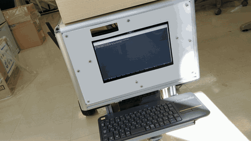
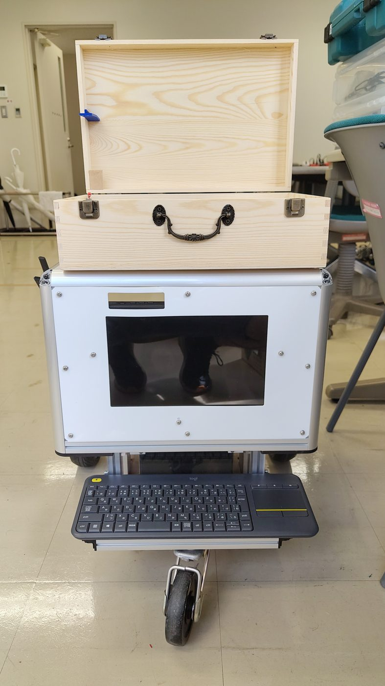
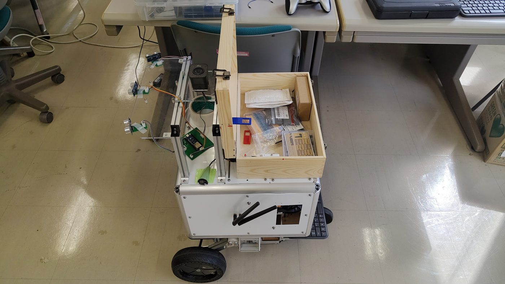
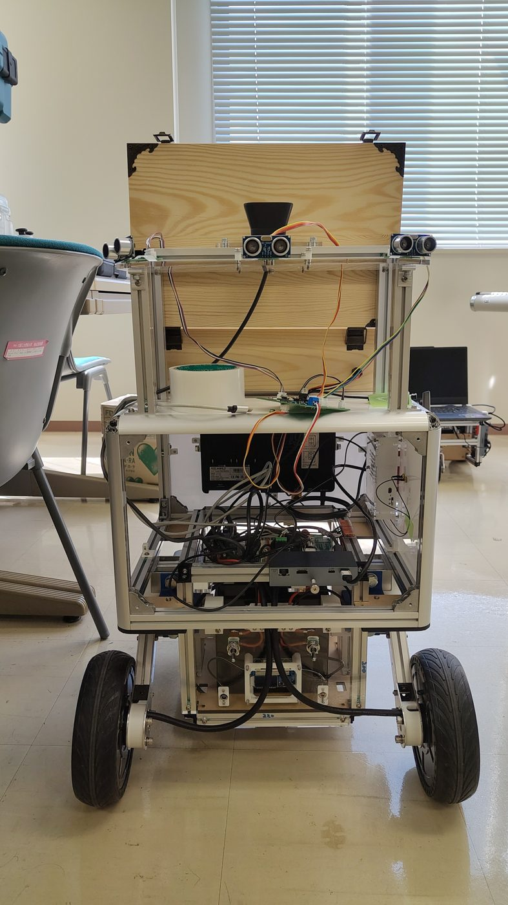
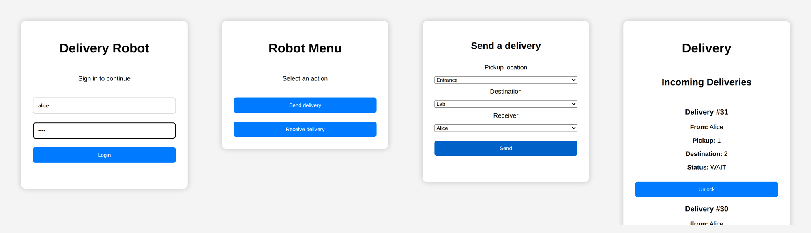
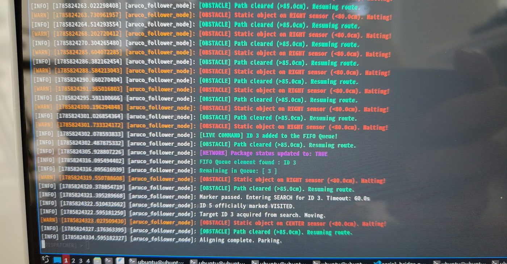
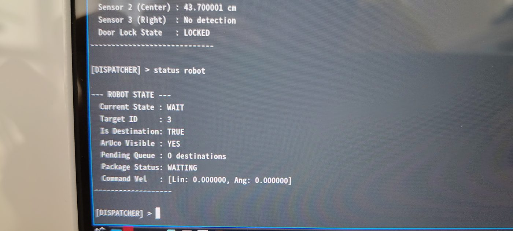
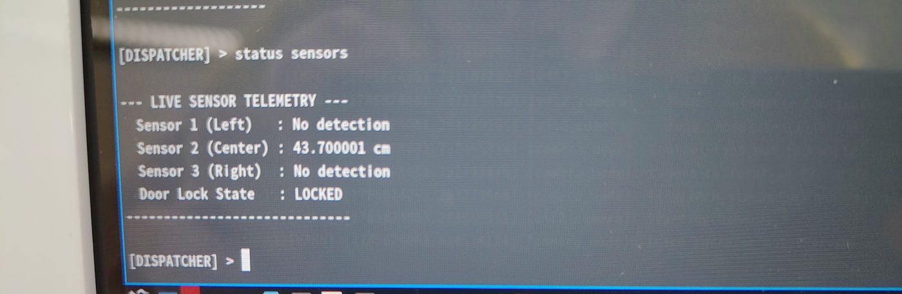

# Japan Delivery Robot Project

**Autonomous indoor delivery robot with a smart electronic locker and a web-based mission platform.**
Developed during a 5-month robotics engineering internship at the **Osaka Institute of Technology** (Japan, April–August 2026).

<p align="center">
  
  
</p>

<!-- DEMO VIDEO: in the GitHub web editor, drag and drop docs/demo_video.mp4 here. GitHub will insert a video player link. -->

---

## Overview

The goal of the project is an indoor robot that carries small packages between predefined locations of a building. A user creates a delivery from a web page, the robot receives the mission through ROS 2, drives to the destination, and the receiver opens a secured locker on the robot to collect the package.

I worked on two parts of the system:

- **Electronic locker (hardware + firmware):** PCB design, actuator interface and ESP32 firmware for the lock, the door sensor and the package detection.
- **Web mission platform:** Node.js backend, web interface, user authentication, database and the bridge between the web application and ROS 2.

---

## System architecture

```
 Web interface (HTML/CSS/JS)
          │  HTTP + WebSocket
          ▼
 Node.js backend (Express, SQLite, ws)
          │  ROS 2 topics via rclnodejs
          │    /mission   (web → robot)
          │    /unlock    (web → locker)
          │    /robot_status (robot → web)
          ▼
 ROS 2 bridge node (C++, rclcpp, ROS 2 Jazzy)
          │
          ▼
 Robot navigation            ESP32 locker controller
                             ├─ solenoid lock (driven through the locker PCB)
                             ├─ door switch (open / closed)
                             ├─ 2 × ultrasonic sensors (package detection)
                             └─ status LED
```

---

## Electronic locker

<p align="center">
  
  
</p>

- **Custom PCB** for the locking mechanism: power stage for the solenoid lock and interface to the ESP32.
- **Package detection** with two ultrasonic sensors. Each measurement is filtered with a 5-sample **median filter** to reject noisy echoes.
- **Door state** read from a normally-open switch (open / closed).
- **Solenoid lock** controlled by the ESP32, with a status LED.
- Firmware: [`Japan-Locker-Project.ino`](Japan-Locker-Project.ino) (Arduino framework, ESP32).

---

## Web mission platform

<p align="center">
  
</p>
<p align="center"><sub>Login → menu → delivery creation → receiver view with the unlock button (demo accounts).</sub></p>

- **Authentication** and user management (SQLite).
- **Delivery creation:** sender, receiver, pickup and destination.
- **Real-time robot status** pushed to the browser through WebSockets.
- **ROS 2 bridge:** the backend publishes missions and unlock commands on ROS 2 topics and forwards the robot status to the web page (`rclnodejs`).
- Tested with several devices on the same local network.

Full demo video (no sound): [`docs/demo_video.mp4`](docs/demo_video.mp4)

Code: [`RobotWeb/`](RobotWeb) (backend in `RobotWeb/backend`, pages in `RobotWeb/frontend`) and [`ROS/robot_web_bridge`](ROS/robot_web_bridge) (C++ ROS 2 package).

---

## Robot in operation

Console output captured on the robot during the tests (full robot stack, developed by the team).

<p align="center">
  
</p>
<p align="center"><sub>ROS 2 logs of the navigation node: the robot halts when an ultrasonic sensor sees an obstacle under 80 cm and resumes above 85 cm (hysteresis), a mission is added to the FIFO queue from the web, the package status is updated, then the robot searches for the ArUco marker and parks.</sub></p>

<p align="center">
  
  
</p>
<p align="center"><sub>Dispatcher console: robot state (current state, target ArUco ID, queue, package status, velocity command) and live telemetry of the three ultrasonic sensors and the door lock.</sub></p>

---

## Technologies

| Area | Tools |
|---|---|
| Embedded | ESP32, Arduino framework, C/C++, ultrasonic sensors, solenoid lock |
| Electronics | PCB design, actuator interface |
| Robotics | ROS 2 Jazzy, rclcpp, rclnodejs |
| Backend | Node.js, Express, WebSocket (ws), SQLite |
| Frontend | HTML, CSS, JavaScript |

---

## Project status

**Done**
- Web interface: authentication, delivery creation and receiver view (the *Unlock* button is only enabled when the robot is waiting at the destination)
- SQLite database for users and deliveries
- Web ↔ backend ↔ ROS 2 communication in both directions, with live status feedback
- Locker firmware: package detection, door sensor, lock control

**Next steps**
- Full integration of the locker with the `/unlock` topic
- Replace the simulated statuses of the C++ bridge with the real navigation states
- Password hashing (bcrypt) for the authentication system

---

## Run the web platform

```bash
# ROS 2 Jazzy must be installed and sourced
cd RobotWeb
npm install
node backend/server.js      # server on http://localhost:8080
```

> **Demo database:** `RobotWeb/backend/robot.db` is included on purpose so the platform can be tested right away. It only contains fictional test accounts (e.g. `alice` / `bob`) with dummy passwords and sample deliveries. Passwords are stored in plain text because this is a prototype; a production version would hash them (e.g. with bcrypt) and would not ship a database in the repository.

Build the ROS 2 bridge:

```bash
cd ROS
colcon build --packages-select robot_web_bridge
source install/setup.bash
ros2 run robot_web_bridge robot_bridge
```

---

## Author

**Aymeric Duchene**, engineering student in Electronics and Embedded Systems at Polytech Montpellier (France).
Project carried out with fellow students during an internship at the Osaka Institute of Technology.

[LinkedIn](https://www.linkedin.com/in/aymeric-duchene) · [GitHub](https://github.com/Aymeric-Dcn)
